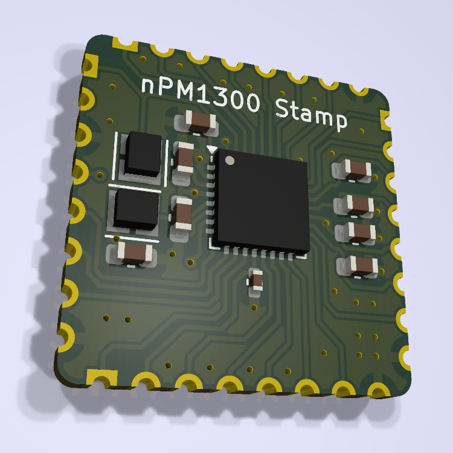

# nPM1300 Module

  

## Overview

Compact module integrating Nordic Semiconductor's nPM1300 PMIC with all necessary passive components. Designed for easy integration into Bluetooth Low Energy embedded systems.

## Key Features

- 800 mA battery charger
- Dual 200 mA buck DCDC regulators
- Fuel gauge functionality
- System-level watchdog
- I2C control interface
- USB-C compatible

## Design Resources

- Schematic symbol available
- PCB footprint available

For detailed specifications, visit [Nordic Semiconductor's nPM1300 page](https://www.nordicsemi.com/Products/nPM1300).
